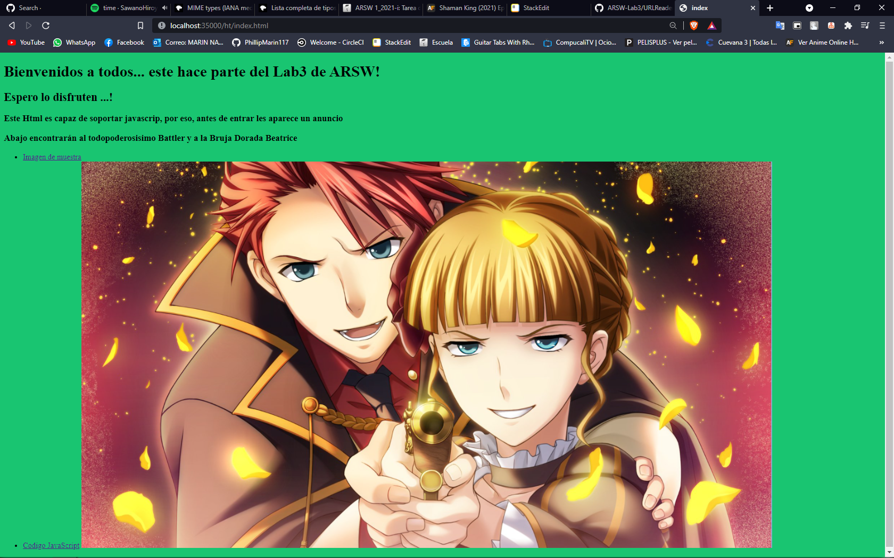
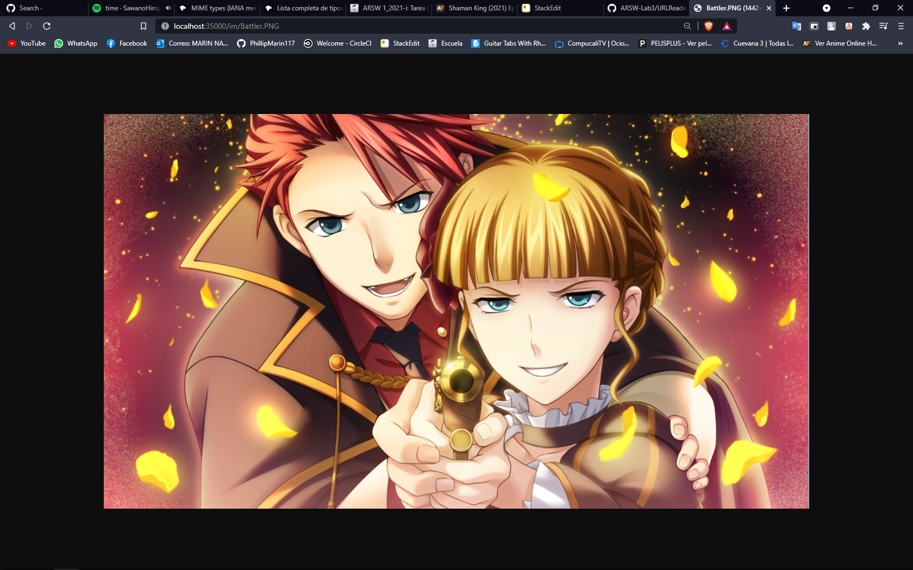

# # Lab3 ARSW-Network Client

El siguiente repositorio contiene varios ejercicios en los cuales se vera una introducción a temas relacionados con manejo de URL's, Sockets por parte de un servidor y un cliente.

## Instrucciones de uso

Para poder usar el proyecto lo primero que debe realizar es clonar este repositorio utilizando el siguiente comando desde la terminal del S.O que este utilizando:

```
git clone https://github.com/PhillipMarin117/ARSW-Lab3
```
Otra alternativa es descargarlo directamente por formato ZIP en el botón que indica **"Clone or Download".**
Luego debe redirigirse por medio de la terminal al directorio raíz la cual contiene el achivo pom.xml.

Una vez se encuentre en este directorio se debe compilar el programa para esto se debe ejecutar el siguiente comando:

```
mvn package
```
### Prerequisitos

Para ejecutar con éxito este programa se requiere de los siguientes programas instalados en su máquina. Se recomienda tener las versiones actualizadas, pero si no al menos con las versiones básicas funcionales. Para lograr conocer si tiene instalados los programas y de paso la versión, ejecute los siguientes comandos
```
java -vesion
git --vesion
mvn -version
```

Le debería aparecer de la siguiente manera
```
java version: "1.8.0_171"
git version: 2.19.1.windows.1
Apache Maven version: 3.6.3
```
Una vez compliado el repositorio completo se encuentra en posibilidad de probar los siguientes ejercicios:

### 3.1. EJERCICIO 1- URLManager

Escriba un programa en el cual usted cree un objeto URL e imprima en pantalla cada uno de los datos que retornan los 8 métodos de siguiente sección: 
getProtocol, getAuthority, getHost, getPort, getPath, getQuery, getFile, getRef.

(Este ejercicio se hizo dentro de clase junto al profesor, lo llamamos **[URLServer](https://github.com/PhillipMarin117/ARSW-Lab3/blob/main/src/main/java/edu/escuelaing/arsw/app/URLService/URLServer.java)**)

#### Comando para ejecutar:
```
java -cp target/ARSW-Lab3-1.0-SNAPSHOT.jar edu.escuelaing.arsw.app.URLService.URLServer
```
Como podemos apreciar, cuando se ejecuta el programa nos muestra todas las solicitudes de la siguiente manera:


### 3.2. EJERCICIO 2 - URLReader

Escriba una aplicación browser que pregunte una dirección URL al usuario y que lea datos de esa dirección y que los almacene en un archivo con el nombre resultado.html. Luego intente ver este archivo en el navegador. Al archivo lo llamamos **[URLReader](https://github.com/PhillipMarin117/ARSW-Lab3/blob/main/src/main/java/edu/escuelaing/arsw/app/URLService/URLReader.java)**.

Este archivo lo corremos común y corriente, Este archivo lo llamamos URLReader. Cuando lo ejecutamos en conjunto con el profesor le pedimos que nos diera el html de **[Google](https://www.google.com/)**. 

Cuando lo ejecutamos nos retorna un HTML el cual guardamos en un editor de texto.

Cuando ejecutamos el **[HTML](https://github.com/PhillipMarin117/ARSW-Lab3/blob/main/src/main/java/resource/google.html)** guardado nos cargará la pagina de Google, pero sin algunos atributos, como lo son el doodle de Google


### 4.3.1. EJERCICIO 3 - SquareService

Escriba un servidor que reciba un número y responda el cuadrado de este número.

Para ejecutar este ejercicio se requiere abrir dos consolas/terminales en las cuales se ejecutará el Socket del servidor  y el Socket del cliente. ***Primero se debe ejecutar el Socket del servidor para que no genere errores.***

#### Comando para ejecutar SquareServiceSocket:
```
java -cp target/ARSW-Lab3-1.0-SNAPSHOT.jar edu.escuelaing.arsw.app.SquareService.SquareServiceServer
```

#### Comando para ejecutar SquareServiceClient:
```
java -cp target/ARSW-Lab3-1.0-SNAPSHOT.jar edu.escuelaing.arsw.app.SquareService.SquareServiceClient
```

Como podemos ver cuando ejecutamos los dos programas nos pide que digitemos un numero, este numero nos retornará su cuadrado


### 4.3.2. EJERCICIO 4 - OperationService

Escriba un servidor que pueda recibir un número y responda con un operación sobre este número. Este servidor puede recibir un mensaje que empiece por “fun:”, si recibe este mensaje cambia la operación a las especificada. El servidor debe responder las funciones seno, coseno y tangente. Por defecto debe empezar calculando el coseno. Por ejemplo, si el primer número que recibe es 0, debe responder 1, si después recibe π/2 debe responder 0, si luego recibe “fun:sin” debe cambiar la operación actual a seno, es decir a a partir de ese momento debe calcular senos. Si enseguida recibe 0 debe responder 0.

En este ejercicio también se requieren de dos terminales/consolas para ejecutar correctamente el programa y como en el caso anterior se debe ejecutar inicilamente el SocketServer (OperationServiceServer) seguido del SocketClient (OperationServiceClient).

#### Comando para ejecutar OperationServiceServer:
```
java -cp target/ARSW-Lab3-1.0-SNAPSHOT.jar edu.escuelaing.arsw.app.SquareService.OperationServiceServer
```
#### Comando para ejecutar OperationServiceClient:
```
java -cp target/ARSW-Lab3-1.0-SNAPSHOT.jar edu.escuelaing.arsw.app.SquareService.OperationServiceClient fun:value number
```
**value:  contiene los siguientes valores validos**

 - fun:sin
 - fun:cos
- fun:tang

El valor por defecto es fun:cos por lo que se puede omitir su llamado y colocar directamente el ***number***

**number: un número cualquiera al que se le quiere aplicar la función indicada**

A continuación podemos que al ejecutarla obtener los siguientes resultados. Recuerde que si quiere poner una operación como π/2 debe haber hecho la operación antes y colocar el resultado

Tambien para cambiar entre funciones, recuerde que debe escribir la funcion de la siguiente manera "*fun:sin*" y seguidamente el numero que desea calcular, ya luego **NO** será necesario volver a escribir la función, si no que se calculara todas de ahí en adelate con la ultima función que se haya solicitado. A continuación se muestra un ejemplo y su ejecución.

Como podemos apreciar sin importar si le mandamos una línea incorrecta como lo es "*Bye*" el programa seguirá ejecutando la ultima operación solicitada que en este caso es "*fun:tan 1*"


### 4.5.1. EJERCICIO 5 - HTML

Escriba un servidor web que soporte múltiples solicitudes seguidas (no concurrentes). El servidor debe retornar todos los archivos solicitados, incluyendo páginas html e imágenes.

#### Comando para ejecutar HttpServer:
```
java -cp target/ARSW-Lab3-1.0-SNAPSHOT.jar edu.escuelaing.arsw.app.HTML.HttpServer
```
Una vez ejecutado diríjase a su navegador de confianza y escriba en el buscador **[localhost:35000/ht/index.html](localhost:35000/ht/index.html)** y lo dirigirá al servidor creado por mi.
El siguiente programa soporta HTML y JavaScrip.

#### Acceso y soporte de JavaScript (http://localhost:35000/js/contador.js)


#### Acceso a HTML (http://localhost:35000/ht/index.html)



#### Acceso a imagen (http://localhost:35000/im/Battler.PNG)




## Diagrama de clases

La siguiente imagen muestra los diagramas de clases contenidos en sus respectivos paquetes en los cuales se encuentran las clases de ClienteSocket (EchoClient) y el ServerSocket (FunctionSocket | EchoServer). Además se incluyen las clases de URLManager que utiliza las propiedades de una clase URL en java y BrowserPrototype la cual guarda una página web y la almacena en un archivo html.


## Construido con


* [Maven](https://maven.apache.org/) - Dependency Management
* [Java](https://www.java.com/es/download/) - Lenguaje de programación
* [JavaScript](https://www.javascript.com/) - Lenguaje de programación
* HTTP 
* [Git](https://github.com/) - Versionamiento


## Authors

* **Felipe Marín** - *LOCS/Hora  660/15 = 44 LOCS/Hora* - Fecha: 11/06/2021


## Licencia

This project is licensed under the MIT License - see the [LICENSE.md](LICENSE.md) file for details